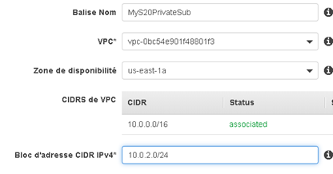
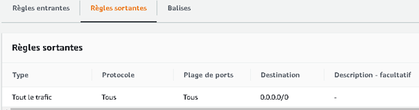

# **AWS - Jumpbox**

## **Objective: create and setup a jumpbox**

A jumpbox is an instance that sit within a public subnet and can be accessed using SSH.

Once remote connectivity has been established with the jumpbox, it allows to use SSH to log in to other instances (within private subnets) deeper within our VPC.

So with this environment we can access a private EC2 instance located in a private subnet with no direct access to Internet.

 

## <u>**Environment requirements:**</u>

\-    1 VPC

\-    1 public subnet

\-    1 private subnet

\-    1 internet gateway associated with the public subnet

\-    3 EC2 instances (jumpbox, nat, final)

\-    2 route tables (1 for each subnet)

\-    3 security groups (1 for each instance)

 

   

## <u>**1. Create a VPC and the subnets**</u>

Open the Amazon console.

Search for VPC, go to VPC Dashboard.

Select Your VPCs in the menu.

Click the blue button Create VPC.

 A virtual private cloud (VPC) is a virtual network dedicated to our AWS account.

It is logically isolated from other virtual networks in the AWS Cloud.

We can launch our AWS resources, such as Amazon EC2 instances, into our VPC.

 

When we create a VPC, we must specify a range of IPv4 addresses for the VPC in the form of a Classless Inter-Domain Routing (CIDR) block; for example, 10.0.0.0/16.

 

 Configure the VPC:

**(1)**	Name: give VPC name

**(2)**:	IP pattern for the network, indicating how many bits must be blocked   for indicating the VPC. (e.g.: 10.0.0.0/16, where 16 bit are blocked to define de VPC)

**(3)**:	Default configuration

**(4)**:	Default configuration

After, click **Create**.

 

 

## <u>**2. Create 2 subnets**</u>

 Go to **Subnets**.

**Create subnet**.

  

**Configure a public subnet:**

 

 Name: give a name to the subnet

VPC: select the name of the VPC created before (here S20_VPC)

AZ:  choose the option that is more suitable for you application, having in mind the proximity to your end user

IPv4 CIDR block: choose the IP pattern for your subnet, respecting the rule already defined in the VPC, indicating how many bits must be blocked for indicating the VPC (e.g.: 10.0.1.0/24, where 24 bit are blocked to define de VPC and the subnet)

 

**Configure a private subnet:**

 

**Name**: give a name to the subnet

**VPC**: select the name of the VPC created before (here S20_VPC)

**AZ**: same AZ as for the public subnet

**IPv4 CIDR block**: choose the IP pattern for your subnet, respecting the rule already defined in the VPC, indicating how many bits must be blocked for indicating the VPC (e.g.: 10.0.1.0/24, where 24 bit are blocked to define de VPC and the subnet)

 

From that point we have 1 VPC with 2 subnets (1 public and 1 private).

For the moment, the two subnets have the same configuration, they were created in exactly the same way.

 A public subnet is a subnet associated with a routing table having a route to an Internet gateway.

So we will add an internet gateway.

 

 

## **3. Create and configure an internet gateway**

In the navigation pane, choose **Internet Gateways**.

**Create internet gateway**.

Give a name to the internet gateway.

Then choose **Create internet gateway** .

After creation, select **Actions**, **Attach to VPC**.

Select the VPC (S20_VPC) in **Available VPCs**.

**Attach internet gateway**.

 

 

## **4. Route table configuration for the public network**

In the navigation pane, choose **Subnets**.

Select the public subnet.

Select **Route Table** (lower part).

 

  

Then click on route table id.

Select **Route**.

Select **Edit Routes**.

**Add route**.

For Destination we choose 0.0.0.0/0 (means everything, each IP corresponding to that mask).

For Target we select the internet gateway created.

 

Then **Save routes**.

 At this point the same table is associated to the 2 subnets.

So we can create a route table for the private subnet.

 

 

## **5. Route table configuration for the private network** 

In the navigation pane, choose **Route Tables**.

**Create route table**.

**Name**: MyPrivateRouteTableS20

**VPC**: select the VPC (S20_VPC)

Click on **Create**.

 

Then, go to **Subnets i**n the navigation pane.

Select the private subnet.

Select **Route Table** (lower part).

**Edit route table association**.

Select a route (MyPrivateRouteTableS20).

 

Click on  **Save**.

 Now we can see 2 different route tables for the public and private subnets.

 

  

 

## **6. EC2 instances configuration**

Select **EC2**.

Click **Launch instance**.

Choose Amazon Linux 2 AMI (HVM), SSD Volume Type and **Select**.

 

**Instance Type**: select a free instance type (**t2.micro**) and **Next**

**Configure Instance Details**:

**Network**: Select VPC created

**Subnet**: MyS20PublicSubnet

**Auto-assign public IP**: Enable

 

 Keep other fields by default and click on **Next**.

 **Add Storage**: default configuration (size 8 GiB) and click on **Next**

 **Add Tags**: click on **Add Tag**, fill **Key** and **Value** and click on **Next**

 

**Configure Security Group**: 

Select **create a new security group**.

**Security group name**: provide a name (unique within the VPC)

**Description**: give a description

**Add Rule**: by default SSH is allowed (SSH allows to connect to the instance)

Other rules can be add later, for now click **Review and Launch**.

  

On the **Review Instance Launch** choose **Launch**.

We are going to be asked to choose a key pair to launch the instance, choose create a new one or use an existing key pair.

The first time we create an instance, we need to create a key pair, this file is used as a password to connect to the instance (if lost we can’t connect to the instance).

So we have to **download a key pair** and to keep it.

 

Then we can click **Launch Instances.**

 

For this exercise we need 3 instances so we have to execute 3 times the previous steps (6. EC2 instances configuration).

**Instance Type** and **Security Group** need to be configured in a specific way for each instance. 

 

 

## **7. Security group configuration** 

Security group settings can be accessed from the EC2 dashboard.

 

**Jumpbox instance configuration**: 

Inbound rules:

 

SSH allows to connect to the instance

ICMP allows ping traffic

We can restrict access by only allowing our public ip (77.XXX.XXX.XX/32)

  

Outbound rules:

 

  

**Nat instance configuration**: 

Inbound rules:

 

 

Outbound rules:

 

 

 **Final instance configuration**: 

Inbound rules:

 

 

Outbound rules:

 

 

 

## **8. Test** 

**Recall** :

From home pc we want to access a private EC2 instance.

From this instance we want to ping “google.com” and obtain a response.

 

**Home pc configuration:** windows 10 pro x64

 

**Requirements:**

1\- Install WSL 2 on the local PC

Via PowerShell

Open PowerShell as an administrator.

 Enter the following command:

​	dism.exe / online / enable-feature / featurename: Microsoft-Windows-Subsystem-Linux / all / norestart

 Activate the "Virtual machine platform" component (WSL 2 only):

​	dism.exe / online / enable-feature / featurename: VirtualMachinePlatform / all / norestart

 Restart your computer

 In addition, we can find also fin a procedure available at : https://docs.microsoft.com/fr-fr/windows/wsl/install-win10

 Via PowerShell, we can define WLS 2 by default, with this command :

​	wsl --set-default-version 2

 

2\- Install a Linux distribution (here, Ubuntu 20.04 LTS)

 

**Test steps**

On AWS – start the instances and check instances are running.

 

 

Copy S20KP.pem file to Ubuntu home directory.

Go to Ubuntu home directory .

 

   

Use SSH-agent to allow instances to access S20KP.pem.

​     chmod 600 S20KP.pem

​     eval `ssh-agent -s`

​     ssh-add S20KP.pem

 

 

Connect to Jumpbox instance

​     ssh -A ec2-user@<public IP jumpbox instance>

 

We are connected to the jumpbox instance (public subnet)

  

Connect to Final instance

​     ssh ec2-user@<private IP final instance>

 

We are connected to the final instance (private subnet)

  

Run test via pinging google.com

​     ping google.com

ctrl+c (to stop ping command)

 

 

 