# **How to host static webpage on AWS S3 bucket**

## Objective: 

Create a S3 bucket and store a static webpage.

Make sure this page is accessible from everyone  on internet.

## What is AWS S3

The Amazon S3 is a easy-to-use **object store** and one of the oldest services on AWS platform.

Amazon S3 is an acronym for **Amazon Simple Storage Service**.

It’s a typical web service that enables us to store and retrieve data via an API reachable over HTTPS.

The service offers unlimited storage space and stores our data in a highly available and durable and secured way.

In S3 we can store any kind of data, such as images, documents, and binaries, as long as the size of a single object doesn’t exceed 5 TB.

### Key terminologies of AWS S3

1. **Bucket** – A bucket is a container for objects stored in Amazon S3. Every S3 object is contained in a bucket. Buckets form the top-level namespace for Amazon S3, and bucket names are global. This essentially means that Bucket names should be unique across all AWS accounts.
2. **Objects** – Objects are the entities or files stored in S3 buckets. An object can be any kind of data in any format. Objects can range in size from 0 bytes up to 5TB, and a single
   bucket can store an unlimited number of objects. This means that a single bucket can store virtually unlimited amount of data.
3. **Keys** – Every object stored in an S3 bucket is identified by a unique identifier called a key.
4. **Object URL** – As S3 is a cloud system, each object is accessible over internet with a unique URL. Generally the URL structure is like this: `https://<region>.s3.amazonaws.com/<bucket>`

## **Steps to Host Static Webpage on AWS S3 Bucket**

### Open AWS Console

Go to S3 console by clicking on the respective **S3** link from the **Storage** section. 

 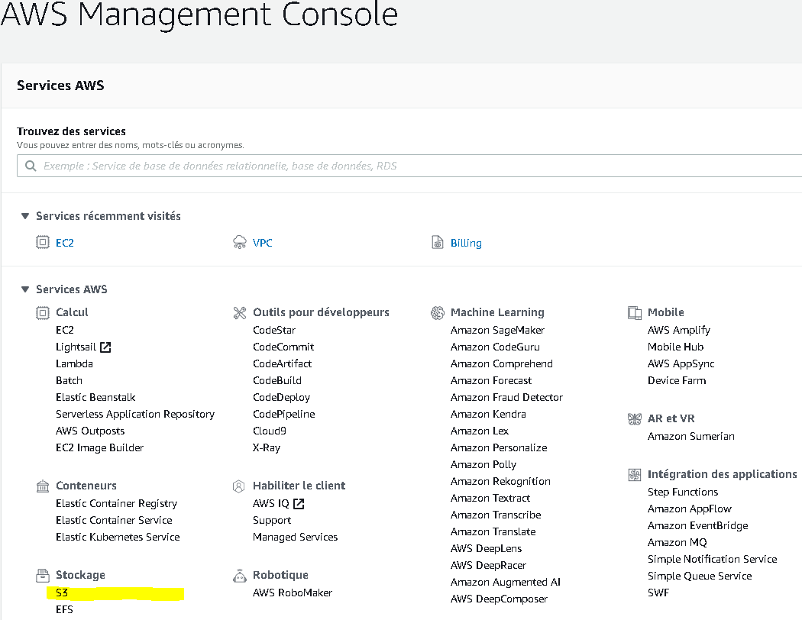

The S3 console will look like below. 

 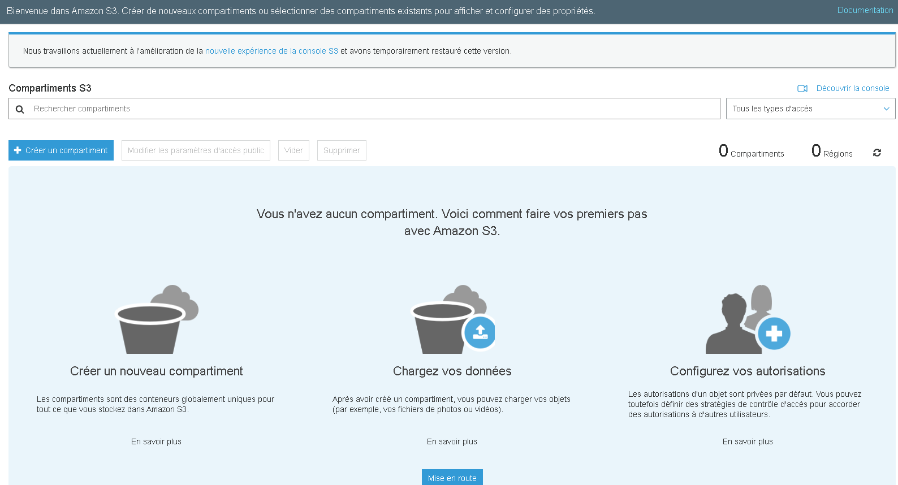

### Create a bucket on AWS S3

Now click on the **create a bucket** in the S3 console, and enter a bucket name.

Please note that the bucket name is unique in the overall AWS platform, so you might face some error message like bucket already exists if you enter a duplicate bucket name that is already created in AWS by someone before.

 So, choose bucket name efficiently to avoid this. Follow official AWS S3 bucket policy for more details.

 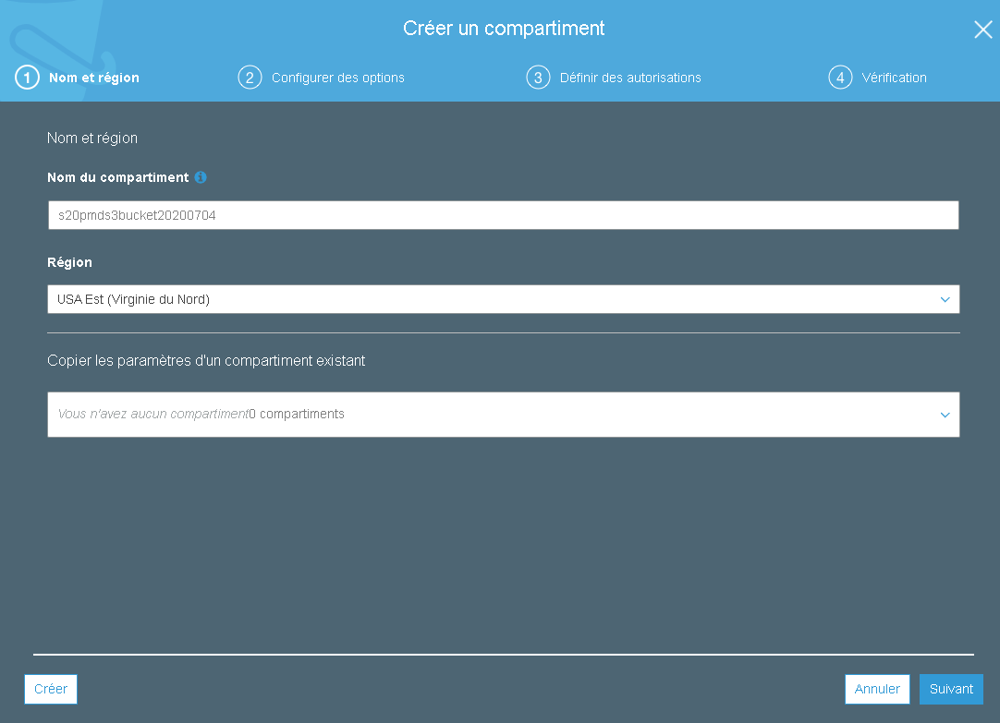

Click on **Create**.

On the next page, keep default options and click on **Next**.

 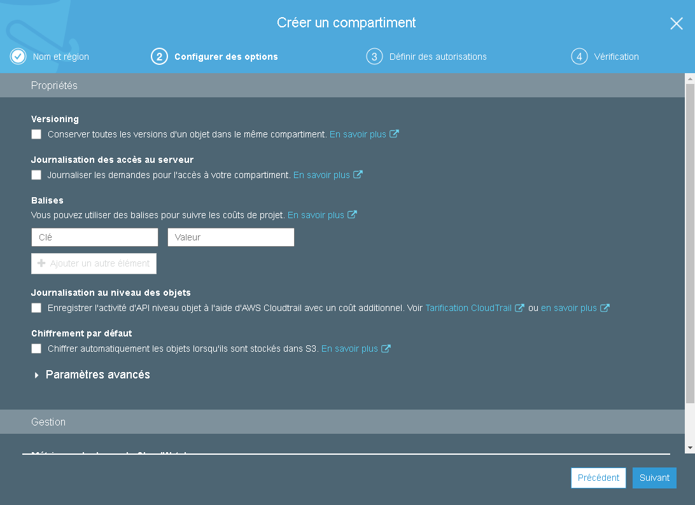

On the next page, enable the public access to the Bucket.

 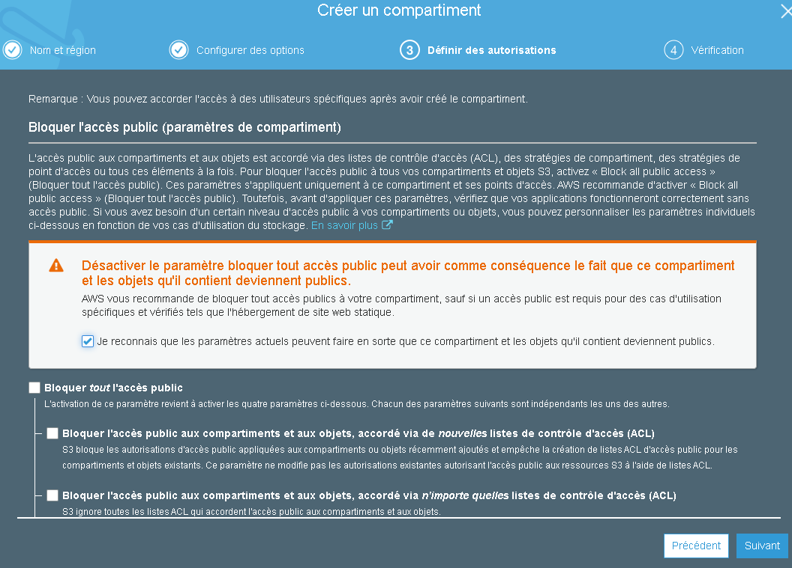

On the last page **create the bucket**.

 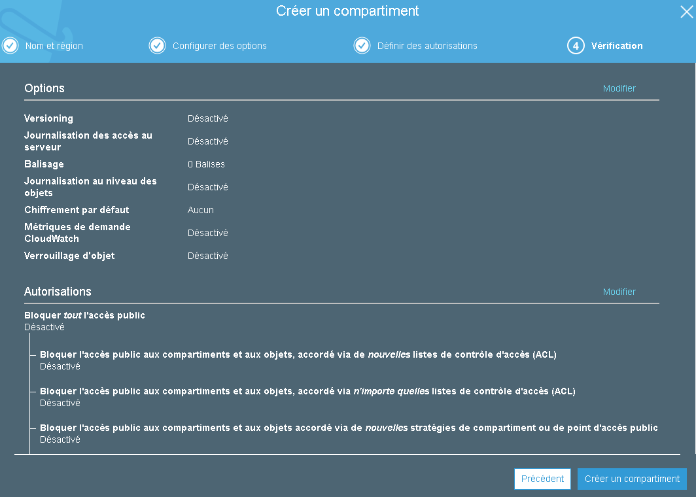

The bucket is now created, it appears as below.

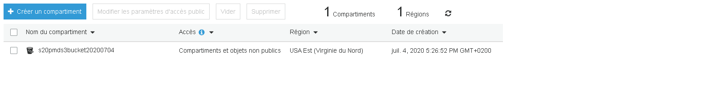

Now click on the bucket name and we will go to the bucket details page.

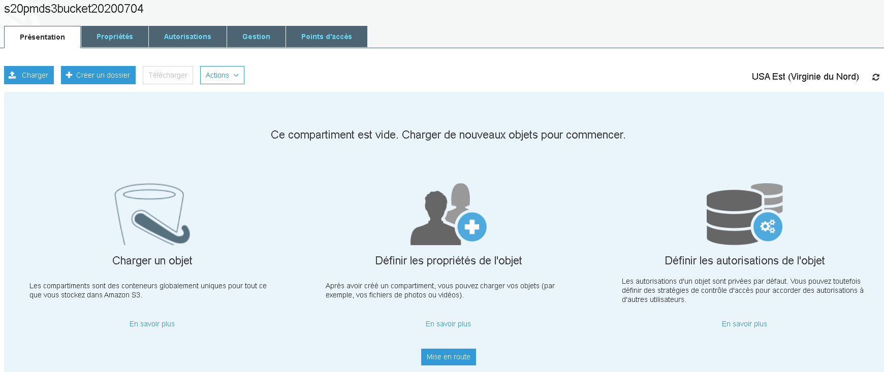

### Upload Static Files to S3 Bucket

For demo purpose, we use a HTML file created before and will upload in S3 and will access it from internet.

This is the upload screen once we click on the **Upload** button.

 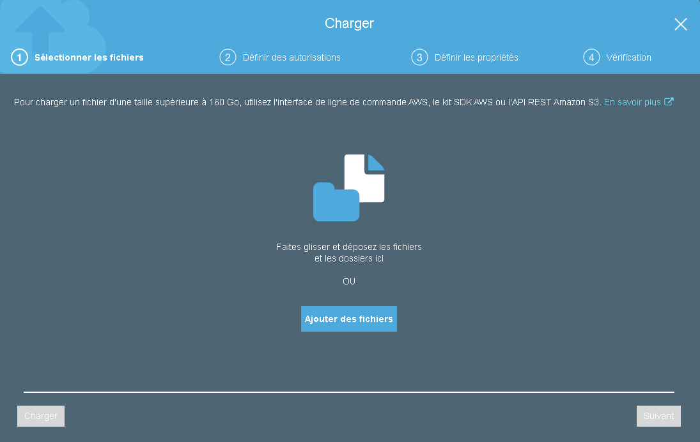

After uploading the screen will look like this.

 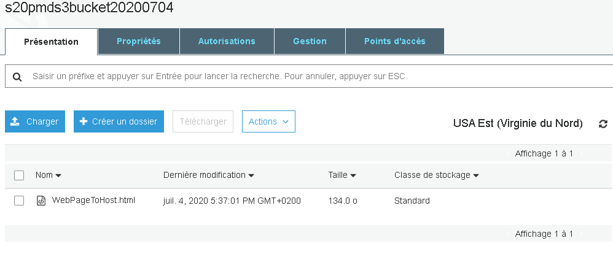

### Test the Uploaded File

Now we will try to access the HTML file from internet. To do that first we need to know the address of this page.

We need to go to the details of the object by clicking on the link of the object.

The details screen will look like below.

 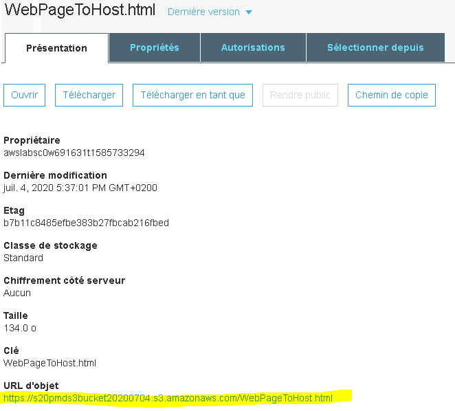

Now click on the link in a separate tab.

We can expect an error as below.

 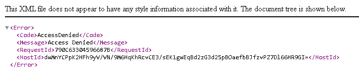

In AWS everything is private and secure by default.

Now we need to set permission to enable the public access of this file to the outside world.

#### Enable Public Access to Objects

In order to make this file accessible to the outside world, we need to make this file public.

To make it public, click on **Make public** button in the top, so that everyone can access this from outside world.

 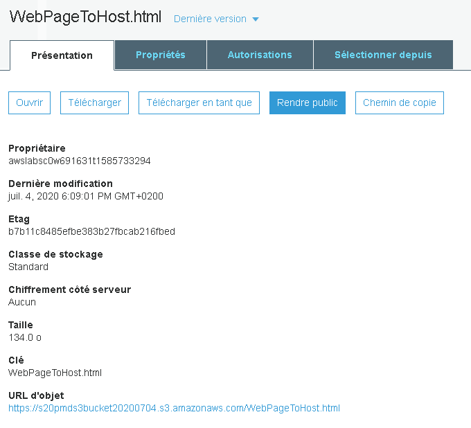

Once this link is public, try again try to access the file from a separate tab to see if it is accessible.

We go on : https://s20pmds3bucket20200704.s3.amazonaws.com/WebPageToHost.html

 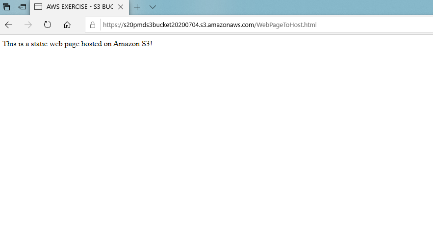

Access to **static web page in S3**  is now possible.

